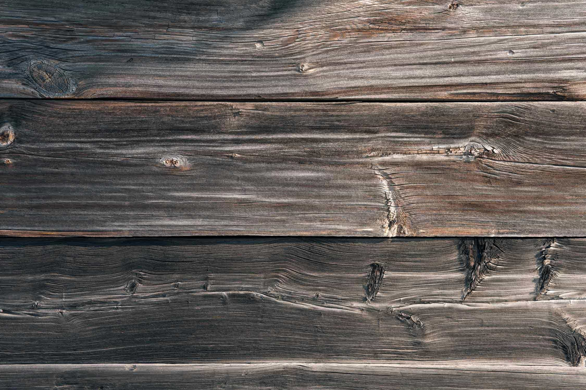

The cold winters and warm summers of Northwest Indiana will take a toll on any deck’s color, quality and foundation. The good news, however, is that many strategies exist to help restore your deck to its earlier glory _without having to perform a total rebuild_.

## Restoring / Re-Decking May Be The Best Option

Determining the scale of work that your deck requires comes down to one factor: does your deck have only surface level wear, or is the foundation losing its integrity? If you have reason to believe that your deck’s foundation is deteriorating, our partners can perform a thorough inspection to determine the severity of the issue.

The types of wear that can typically be resolved by restorative practices are as follows:

- Faded coloring
- Raised and protruding screws
- Flaking and peeling paint
- Fascia bowing & moisture damage
- Minor sagging of joists

Outside of extreme cases, decks with a reasonable combination of the above problems can be restored to satisfactory condition. Sometimes, however, the cost of individual repairs begins to brush up with the cost of a total rebuild.

## Replacing Your Deck

There are certain foundational parts of your deck that, if damaged, compromise the integrity of the entire structure. Keep an eye out for the following:

- A significant combination of the issues listed in the previous section
- Significant wood rot
- Compromised ledger board (connects deck to house)
- Diminished post integrity

Any of the above problems are likely to point to serious safety risks requiring urgent attention. Again, a thorough inspection should always be conducted to determine the severity of the safety risks at hand.

## Deciding What’s Best

Unless your deck has become an overt safety risk, there are several options for restoring what already exists. In fact, some of these options may come into play due to other renovations happening to your home or landscaping.

Our partners can estimate a repair that includes the following services and more:

- Replacing weakened boards
- Painting and refinishing
- Replacing railings or steps
- Replacing joists and installing blocking

As a final notice, if you’re planning on combining a deck restoration with any significant add-ons or redesigns, it may be wise to consider a full rebuild. Before making a significant investment into new deck features, it is always wise to start from a new build so as to ensure the most longevity out of your new investment.

Whether you’d like to restore your deck or plan for a rebuild, [contact us today](#how-to) to get started with an expert decking contractor in Northwest Indiana.
