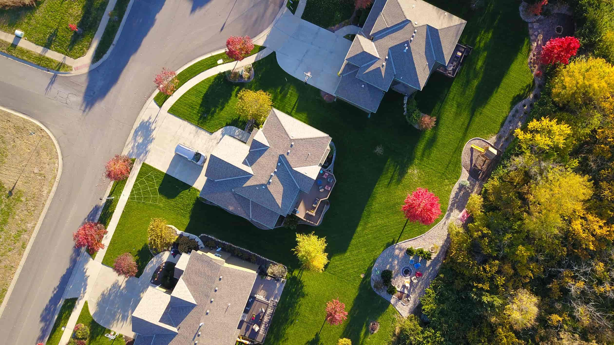

Home renovations are tricky business. One would think that any improvements made to the quality of their home should increase the value of the property, but we all know this isn’t the case.

## Where Do Decks Fit Into The Discussion Of Added Property Value?

Very few home projects are likely to wind up putting you _ahead_ when it comes time to list your home on the market. Therefore, the measurement of a worthwhile renovation can be measured in the percentage of investment that you are likely to recoup at the time you sell your house.

By that logic, building a new deck is one of the most promising types of home renovations. In 2020, a new wood deck is likely to recoup 72.1% of job cost in resale value, [according to recent studies](https://www.remodeling.hw.net/cost-vs-value/2020/). A composite deck will recoup an average of 66.8%. Both of these averages fall within the top 25 - 50% of costs recouped in standard home renovation projects.

## The Hidden Value Of Repair

Most of the data that exists in this space provides insight on costs for a new deck compared to resale value. One stat that is missing is the return on investment for a strategic deck repair.

If your home included a deck when you purchased it, and that deck has undergone a few harsh winters and summers but is still of solid foundation, you are in a great position. By hiring one of our partners to perform routine maintenance and repair, you may end up increasing your home’s value by a dollar amount higher than what you spent on the job.

## Quality Of Life Matters Too

Depending on how long you plan to live in your current home, a new deck has the capability of greatly increasing what we refer to as _live-in _ property value. Even if a new deck is unlikely to recoup 100% of its job cost at the time of resale, the amount of value it will add to the enjoyment of your property cannot be overlooked. Decks (especially of the composite variety) also tend to hold onto their value for many years.

In all, building a new deck (or repairing an existing one) is one of the better renovations you can make to increase the property value of your home. [Contact us today](#how-to) to set your decking project underway.
